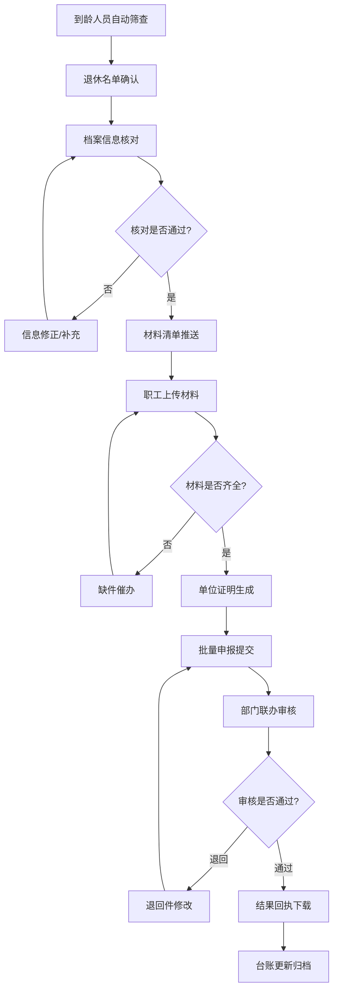

# 退休批量申报协同系统 产品需求文档

## 1. 产品概述

退休批量申报协同系统是面向机关事业单位、国企和大型园区人事部门的业务协同平台，将员工退休前预审、单位证明出具和集中报送整合在一套流程中，解决多人同时办理、口径不一致、材料来回追的问题。

- **核心目标**：提升人事部门退休办理效率，规范办理流程，减少材料往返
- **目标用户**：单位人事专员、人事主管、部门领导、退休职工
- **产品价值**：实现退休业务全流程线上化、协同化、可追溯

## 2. 核心功能

### 2.1 用户角色

| 角色 | 说明 | 核心权限 |
|------|------|----------|
| 人事专员 | 具体办理退休业务的经办人 | 名单管理、材料收集、批量申报、结果查看 |
| 人事主管 | 人事部门负责人 | 审核确认、批量审批、台账查看 |
| 部门领导 | 单位分管领导 | 审批、统计查看、决策支持 |
| 退休职工 | 待办理退休的员工 | 查看个人信息、确认事项、上传材料 |
| 系统管理员 | 系统运维人员 | 用户管理、参数配置、模板维护 |

### 2.2 功能模块

系统分为 6 大核心模块：

1. **退休名单**：到龄人员自动提醒、批量导入待退职工、退休批次管理
2. **职工档案核对**：岗位与工龄信息核对、档案信息比对、差异标注
3. **材料协同**：单位证明模板生成、个人待确认事项推送、缺件催办
4. **批量申报**：批量提交联办事项、退回件集中修改、申报状态跟踪
5. **结果回传**：结果回执下载、办理进度查询、异常处理
6. **台账统计**：已办未办对比、年度退休台账、多维度统计分析

### 2.3 页面详情

| 页面名称 | 模块名称 | 功能描述 |
|---------|---------|----------|
| 工作台首页 | 全局 | 待办事项、数据概览、快捷入口、通知提醒 |
| 退休名单列表 | 退休名单 | 待退人员列表、批量导入、到龄提醒、批次管理 |
| 退休人员详情 | 退休名单 | 个人基本信息、退休类型、办理进度 |
| 档案核对列表 | 职工档案核对 | 核对任务列表、核对状态、批量核对 |
| 档案核对详情 | 职工档案核对 | 岗位信息、工龄信息、社保信息、差异对比 |
| 材料清单 | 材料协同 | 材料清单、上传进度、缺件提醒 |
| 证明模板管理 | 材料协同 | 证明模板列表、模板编辑、预览打印 |
| 批量申报列表 | 批量申报 | 申报批次、申报状态、批量操作 |
| 申报详情 | 批量申报 | 申报材料、审核意见、流程记录 |
| 结果回传列表 | 结果回传 | 办理结果、回执下载、退回件管理 |
| 退休台账 | 台账统计 | 年度台账、月度统计、部门分布 |
| 统计分析 | 台账统计 | 已办未办对比、办理时效分析、趋势图表 |
| 系统设置 | 全局 | 用户管理、角色权限、参数配置 |

## 3. 核心流程

### 3.1 退休办理主流程

人事专员从退休名单中筛选待退人员，发起退休办理流程。首先进行档案信息核对，确认岗位、工龄等关键信息无误后，推送材料清单和待确认事项给职工本人。职工上传材料并确认事项后，人事专员审核材料，缺件进行催办。材料齐全后生成单位证明，批量提交至社保等部门联办。办理结果回传后，下载回执并更新台账。

### 3.2 流程图

## 4. 用户界面设计

### 4.1 设计风格

- **设计定位**：专业稳重、高效务实的政务/企业级业务系统
- **主色调**：深蓝系（#1e40af ~ #1e3a8a），体现专业、可信、稳重
- **辅助色**：
  - 成功：翠绿色（#059669）
  - 警告：琥珀色（#d97706）
  - 错误：赤红色（#dc2626）
  - 信息：天蓝色（#0284c7）
- **中性色**：从 #f8fafc 到 #1e293b 的灰色阶
- **按钮风格**：圆角 6px，扁平设计，悬停有微交互
- **字体**：
  - 标题："Noto Sans SC"，字重 600-700
  - 正文："Noto Sans SC"，字重 400
  - 数据表格：等宽数字字体
- **布局风格**：左侧导航 + 顶部标题栏 + 主内容区的经典后台布局
- **卡片风格**：白色卡片，1px 边框，4px 圆角，轻量阴影
- **图标风格**：线性图标，统一 24px 尺寸

### 4.2 页面设计概览

| 页面名称 | 模块名称 | UI 元素 |
|---------|---------|---------|
| 工作台 | 全局 | 数据卡片、待办列表、快捷入口、图表 |
| 退休名单 | 退休名单 | 搜索筛选、数据表格、批量操作、导入导出 |
| 档案核对 | 职工档案核对 | 左右对比布局、差异高亮、核对状态标签 |
| 材料协同 | 材料协同 | 材料清单、进度条、上传区域、催办按钮 |
| 批量申报 | 批量申报 | 批次卡片、流程时间线、批量提交按钮 |
| 结果回传 | 结果回传 | 状态标签、回执预览、下载按钮 |
| 台账统计 | 台账统计 | 柱状图、折线图、饼图、数据透视表 |

### 4.3 响应式设计

- **桌面优先**：以 1440px 宽度为基准设计
- **大屏适配**：支持 1920px 及以上宽屏，内容区最大宽度限制
- **平板适配**：左侧导航可收起，主内容区自适应
- **不支持移动端**：本系统为桌面端业务系统，针对大屏优化

### 4.4 交互细节

- 表格行悬停高亮
- 状态标签颜色区分明显
- 批量操作有确认提示
- 表单输入有即时校验反馈
- 数据加载有骨架屏/loading 状态
- 操作成功/失败有消息提示
- 重要操作有二次确认弹窗

