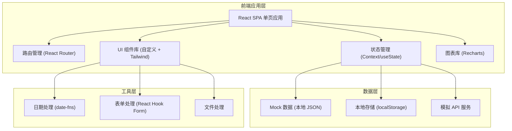
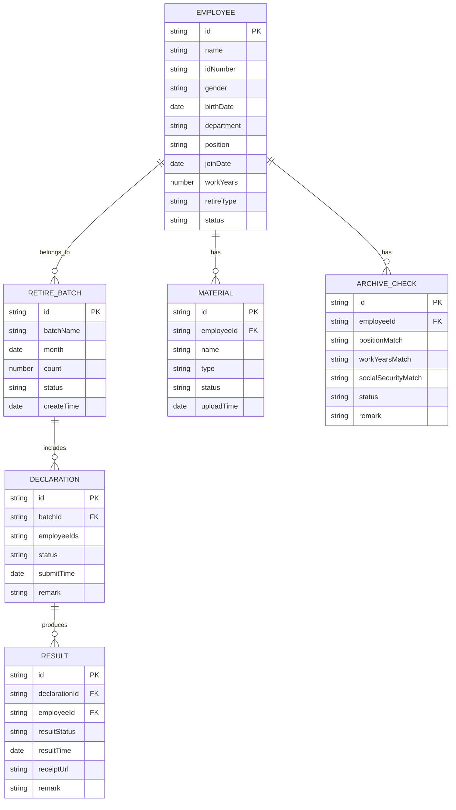

# 退休批量申报协同系统 技术架构文档

## 1. 架构设计



## 2. 技术选型

| 类别 | 技术 | 版本 | 说明 |
|------|------|------|------|
| 前端框架 | React | 18.x | 组件化开发，生态丰富 |
| 构建工具 | Vite | 5.x | 快速构建，热更新 |
| 样式方案 | Tailwind CSS | 3.x | 原子化 CSS，高效开发 |
| 路由 | React Router | 6.x | 单页路由管理 |
| 图表 | Recharts | 2.x | React 图表库 |
| 日期处理 | date-fns | 3.x | 轻量日期工具库 |
| 语言 | TypeScript | 5.x | 类型安全 |
| 图标 | Lucide React | ^0.344.0 | 线性图标库 |
| 状态管理 | React Context + useState | - | 轻量状态管理 |

## 3. 目录结构

```
src/
├── assets/              # 静态资源
│   └── images/
├── components/          # 公共组件
│   ├── layout/         # 布局组件
│   │   ├── Sidebar.tsx
│   │   ├── Header.tsx
│   │   └── MainLayout.tsx
│   ├── ui/             # 基础 UI 组件
│   │   ├── Button.tsx
│   │   ├── Table.tsx
│   │   ├── Modal.tsx
│   │   ├── Tabs.tsx
│   │   ├── Card.tsx
│   │   ├── Badge.tsx
│   │   └── Input.tsx
│   └── common/         # 业务通用组件
│       ├── StatusTag.tsx
│       ├── PageHeader.tsx
│       └── SearchBar.tsx
├── pages/              # 页面组件
│   ├── dashboard/      # 工作台
│   ├── retire-list/    # 退休名单
│   ├── archive-check/  # 档案核对
│   ├── material/       # 材料协同
│   ├── declaration/    # 批量申报
│   ├── result/         # 结果回传
│   └── statistics/     # 台账统计
├── data/               # Mock 数据
│   ├── employees.ts
│   ├── batches.ts
│   ├── materials.ts
│   └── statistics.ts
├── types/              # TypeScript 类型定义
│   ├── employee.ts
│   ├── batch.ts
│   ├── material.ts
│   └── common.ts
├── hooks/              # 自定义 Hooks
│   ├── useModal.ts
│   └── useTable.ts
├── utils/              # 工具函数
│   ├── date.ts
│   ├── format.ts
│   └── storage.ts
├── router/             # 路由配置
│   └── index.tsx
├── App.tsx
├── main.tsx
└── index.css
```

## 4. 路由定义

| 路由路径 | 页面名称 | 模块 | 说明 |
|---------|---------|------|------|
| `/dashboard` | 工作台 | 全局 | 系统首页，数据概览 |
| `/retire-list` | 退休名单 | 退休名单 | 待退人员列表 |
| `/retire-list/:id` | 人员详情 | 退休名单 | 个人退休详情 |
| `/archive-check` | 档案核对 | 职工档案核对 | 核对任务列表 |
| `/archive-check/:id` | 核对详情 | 职工档案核对 | 档案信息核对 |
| `/material` | 材料清单 | 材料协同 | 材料管理 |
| `/material/templates` | 证明模板 | 材料协同 | 模板管理 |
| `/declaration` | 批量申报 | 批量申报 | 申报批次列表 |
| `/declaration/:id` | 申报详情 | 批量申报 | 申报材料详情 |
| `/result` | 结果回传 | 结果回传 | 办理结果 |
| `/statistics/ledger` | 退休台账 | 台账统计 | 年度月度台账 |
| `/statistics/analysis` | 统计分析 | 台账统计 | 多维度分析 |

## 5. 数据模型

### 5.1 数据模型 ER 图



### 5.2 核心类型定义

```typescript
// 职工信息
interface Employee {
  id: string;
  name: string;
  idNumber: string;
  gender: 'male' | 'female';
  birthDate: string;
  department: string;
  position: string;
  joinDate: string;
  workYears: number;
  retireType: 'normal' | 'early' | 'special' | 'illness';
  status: 'pending' | 'checking' | 'material' | 'declaring' | 'done' | 'rejected';
  phone?: string;
  address?: string;
}

// 退休批次
interface RetireBatch {
  id: string;
  batchName: string;
  month: string;
  count: number;
  status: 'draft' | 'submitted' | 'processing' | 'completed';
  createTime: string;
  employeeIds: string[];
}

// 档案核对
interface ArchiveCheck {
  id: string;
  employeeId: string;
  positionInfo: {
    archive: string;
    actual: string;
    match: boolean;
  };
  workYearsInfo: {
    archive: number;
    actual: number;
    match: boolean;
  };
  socialSecurityInfo: {
    archive: number;
    actual: number;
    match: boolean;
  };
  status: 'pending' | 'checking' | 'passed' | 'rejected';
  checkTime?: string;
  checker?: string;
  remark?: string;
}

// 材料项
interface MaterialItem {
  id: string;
  employeeId: string;
  name: string;
  type: 'id' | 'proof' | 'certificate' | 'other';
  required: boolean;
  status: 'pending' | 'uploaded' | 'approved' | 'rejected';
  uploadTime?: string;
  fileUrl?: string;
  remark?: string;
}

// 申报记录
interface Declaration {
  id: string;
  batchId: string;
  batchName: string;
  employeeCount: number;
  status: 'draft' | 'submitted' | 'processing' | 'completed' | 'rejected';
  submitTime?: string;
  auditor?: string;
  remark?: string;
}

// 办理结果
interface DeclarationResult {
  id: string;
  declarationId: string;
  employeeId: string;
  employeeName: string;
  resultStatus: 'passed' | 'rejected' | 'processing';
  resultTime?: string;
  receiptUrl?: string;
  remark?: string;
}
```

## 6. 状态码定义

| 状态类型 | 状态值 | 显示文本 | 颜色 |
|---------|--------|---------|------|
| 办理状态 | pending | 待办理 | 灰色 |
| 办理状态 | checking | 核对中 | 蓝色 |
| 办理状态 | material | 材料收集中 | 橙色 |
| 办理状态 | declaring | 申报中 | 紫色 |
| 办理状态 | done | 已完成 | 绿色 |
| 办理状态 | rejected | 已退回 | 红色 |
| 材料状态 | pending | 待上传 | 灰色 |
| 材料状态 | uploaded | 已上传 | 蓝色 |
| 材料状态 | approved | 已通过 | 绿色 |
| 材料状态 | rejected | 已退回 | 红色 |
| 申报状态 | draft | 草稿 | 灰色 |
| 申报状态 | submitted | 已提交 | 蓝色 |
| 申报状态 | processing | 处理中 | 橙色 |
| 申报状态 | completed | 已完成 | 绿色 |
| 申报状态 | rejected | 已退回 | 红色 |

## 7. 关键技术决策

### 7.1 为什么选择 Tailwind CSS
- 原子化 CSS，减少样式文件体积
- 开发效率高，不需要频繁切换文件
- 易于维护和扩展
- 与 React 组件化开发配合良好

### 7.2 为什么选择 Recharts
- 基于 React 的图表库，组件化使用
- 文档完善，社区活跃
- 支持常用图表类型（柱状图、折线图、饼图）
- 可定制性强

### 7.3 Mock 数据方案
- 前端独立开发，不依赖后端
- 使用 TypeScript 类型定义保证数据结构一致性
- 数据存储在本地，支持刷新不丢失（localStorage）
- 便于演示和测试

